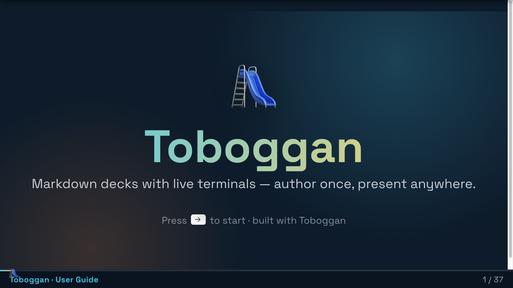
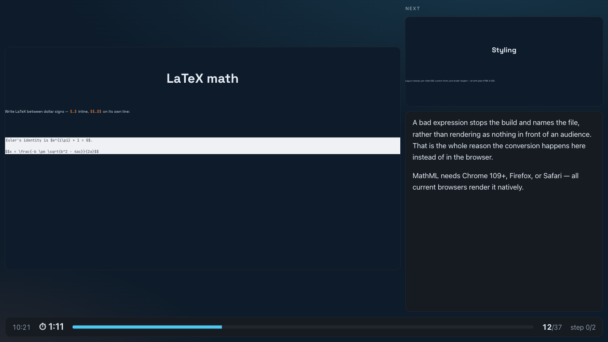
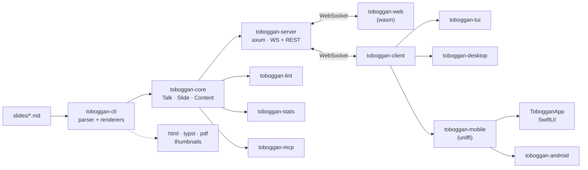

<div align="center">


# Toboggan 🛝

**Write a talk in Markdown. Serve it. Present it from anywhere in the room.**

[](https://github.com/ilaborie/toboggan/actions/workflows/ci.yml)
[](https://github.com/ilaborie/toboggan/actions/workflows/release.yml)
[](#license)
[](https://www.rust-lang.org)

</div>

## What it is

A deck is a folder of Markdown files. `toboggan` builds it, serves it over
WebSocket + REST, and every connected client stays on the same slide and the
same reveal — a browser on the projector, a terminal on your laptop, a phone in
your hand.

```bash
toboggan -p my-talk     # build in memory, serve, reload on save
```

<div align="center">
  
</div>

That one command covers the whole authoring loop. There are also exporters (a
self-contained HTML deck, a PDF, a thumbnail overview), a presentation linter, a
presenter view with notes and a timer, and an MCP server for writing slides with
an LLM.

> **Note**: this is an educational and fun project, built to explore how far
> Rust reaches — the same domain crate drives an axum server, a WebAssembly
> browser client, a ratatui terminal, an iced desktop window, and an iOS app
> over UniFFI. It works, and it has given real talks, but it is a playground
> first.

## Install

### From a release (recommended)

Releases publish `x86_64-unknown-linux-gnu` and `aarch64-apple-darwin` binaries:

```bash
# Linux x86_64 / macOS Apple Silicon — pick your target
target=aarch64-apple-darwin
curl -fsSL "https://github.com/ilaborie/toboggan/releases/latest/download/toboggan-$target.tar.gz" \
  | tar -xz -C ~/.local/bin
toboggan --version
```

> [!WARNING]
> **Do not run `cargo install toboggan`.** The name `toboggan` on crates.io
> belongs to an unrelated project; you will get a stranger's binary that happens
> to share the name, and every command below will fail on unrecognised
> arguments. This project is not published to crates.io.

### From source

Building from source needs the web toolchain too: `toboggan-server` embeds
`toboggan-web/dist` at compile time, and its `build.rs` fails when that folder is
absent.

```bash
git clone https://github.com/ilaborie/toboggan
cd toboggan
mise build:web              # wasm-pack + pnpm → toboggan-web/dist
cargo install --path toboggan
```

## Quick start

```bash
# Scaffold a deck: slides/, public/, toboggan.toml, a jj repo, MCP + skill wiring
toboggan new -p my-talk --title "My Presentation"

# Build it in memory and serve it, reloading whenever a file changes.
# -p defaults to ".", so `cd my-talk && toboggan` also works.
toboggan -p my-talk
```

Then open:

| Route | What it is |
| --- | --- |
| `/` | Homepage — links to everything below |
| `/run` | The deck. This is what goes on the projector |
| `/presenter` | Notes, the next slide, a timer and pacing |
| `/slides` | Thumbnail overview with search |
| `/guide` | The full authoring guide, served with any deck |
| `/download.pdf` | The deck as a PDF (needs `typst`) |
| `/doc` | OpenAPI reference for the REST API |

The guide's source lives in [`examples/toboggan-guide/`](examples/toboggan-guide)
— a real Toboggan deck you can read on disk, or lint and build like any other.

## Commands

| Command | Purpose |
| --- | --- |
| `toboggan -p <folder>` | Build + serve with a folder watch (the default action) |
| `toboggan watch -p <folder>` | The default action, named explicitly |
| `toboggan build -p <folder> -o out.{toml,json,yaml,html,typ}` | Build to a file |
| `toboggan serve -p <talk.toml>` | Serve an already-built talk (a **file**, not a folder) |
| `toboggan new -p <dir>` | Scaffold a presentation |
| `toboggan lint -p <folder>` | Lint the deck (`--format`, `--deny`, `--no-spell`) |
| `toboggan stats -p <folder>` | Word counts and duration estimates |
| `toboggan pdf -p <folder>` | Render a PDF (needs `typst`) |
| `toboggan thumbnails -p <folder>` | Per-slide PNGs + `overview.html` + search |
| `toboggan tui` / `toboggan desktop` | Clients against a running server |
| `toboggan openapi` | Emit the bundled OpenAPI document |
| `toboggan mcp [serve\|init]` | MCP authoring server, or install it for Claude Code |
| `toboggan skills` | Install the authoring skill for Claude Code |
| `toboggan completion <shell>` | Print a completion script (bash/zsh/fish/…) |

```bash
toboggan build -p ./my-talk/slides -o talk.html   # a single navigable file
toboggan lint  -p ./my-talk/slides --format github
toboggan pdf   -p ./my-talk/slides
```

## Configure a deck

`toboggan new` writes a `toboggan.toml` listing every setting, commented out with
its default — it is the reference for what can be configured. Anything you can
pass as a flag can live there instead:

```toml
default-command = "lint"   # what a bare `toboggan` does

[build]
theme = "Solarized (dark)"
wpm = 130

[serve]
open-presenter = true
```

Files are read from the deck directory, then each parent directory, then
`~/.config/toboggan/config.toml` — so a repo of several decks can share a house
style and one deck can override it. Precedence, strongest first:

```
CLI flag  >  TOBOGGAN_* env var  >  nearest toboggan.toml  >  … >  user global  >  default
```

An unknown key is an error rather than a silent no-op, so a typo tells you.

## Present

The server binds to `127.0.0.1` by default, and a client connecting from the
machine running the server may drive the deck. Open it to the room with
`--host 0.0.0.0` and the rule changes:

| | `/`, `/run`, `/api/talk` | navigation | `/api/terminal` |
| --- | --- | --- | --- |
| from this machine | ✅ | ✅ | ✅ |
| from the network | ✅ | ✗ | ✗ |
| from the network, with `--presenter-token` | ✅ | ✅ | ✅ |

The embedded terminals spawn a real shell on the presenter's machine, so the
room gets to watch and nothing more. A second device joins as a presenter by
carrying the token: `http://<your-ip>:8080/run?token=…`.

See [SECURITY.md](SECURITY.md) for the full posture.

### The presenter view

`/presenter` is the same application as `/run` with the things a presenter needs
around it — the next slide, the notes for where you are, and a status strip with
the clock, an elapsed timer, deck progress, and how far ahead or behind the
deck's declared `duration` you are running. Both previews are laid out at
projector width and painted small, so a line that wraps here wraps in the room.

<div align="center">
  
</div>

`--open-presenter` opens both windows at once: this one on your screen, the deck
on the projector.

### Clients

Every client speaks the same WebSocket protocol and stays in sync with the rest.

| | Web `/run` | Web `/presenter` | TUI | Desktop | iOS / Android |
| --- | :-: | :-: | :-: | :-: | :-: |
| Slides and step reveals | ✅ | ✅ | ✅ | ✅ | ✅ |
| Speaker notes | — | ✅ | ✅ | ✅ | — |
| Next-slide preview | — | ✅ | ✅ | — | — |
| Elapsed timer and pacing | — | ✅ | — | — | — |
| Embedded terminals | ✅ | — | — | — | — |
| Presenter remote (PageUp/PageDown) | ✅ | ✅ | ✅ | ✅ | — |
| Go to slide by number | ✅ | ✅ | ✅ | — | — |
| Fullscreen | ✅ `f` | — | n/a | ✅ `F11` | — |
| Blank the screen | ✅ `.` `w` | — | — | — | — |
| Help overlay | ✅ `F1` | — | ✅ `h` | ✅ `h` | — |

- **Web** (`toboggan-web`) — TypeScript + WebAssembly, embedded in the binary.
  `/run` is the deck; `/presenter` is the same application with notes, the next
  slide and a timer around it. Open both with `--open-presenter`.
- **Terminal** (`toboggan tui`) — [ratatui]; renders slides as text, with notes,
  a next-slide preview and a slide list. Good over ssh.
- **Desktop** (`toboggan desktop`) — a native [iced] window.
- **iOS** (`TobogganApp/`) — SwiftUI over the `toboggan-mobile` crate via
  [uniffi]. The same crate backs Android through `toboggan-android`.

## Use in CI

This repository publishes a composite action that builds a deck into artifacts
you can deploy:

```yaml
- uses: ilaborie/toboggan@v0.1.0
  with:
    folder: ./slides          # default ./slides
    outputs: html,pdf,thumbnails
    out-dir: dist             # default dist
    base-url: ""              # only for absolute asset URLs
    version: v0.1.0           # release of toboggan to install
```

A complete Pages workflow lives in
[`examples/github-pages/pages.yml`](examples/github-pages/pages.yml). This repo
uses the action on itself — see
[`.github/workflows/pages.yml`](.github/workflows/pages.yml), which publishes
the guide deck.

## Architecture



`toboggan-core` holds the domain model and the wire protocol, and depends on
nothing else in the workspace. Everything else — the parser, the server, the
linter, and every client — is built around it.

### Workspace members

```
toboggan/
├── toboggan-core/       # Domain model (Talk, Slide, Content, Command, …)
├── toboggan-stats/      # Word/step/image counts and HTML inspection
├── toboggan-cli/        # Folder parser + renderers (toml/json/yaml/html/typst) + thumbnails
├── toboggan-server/     # Axum WebSocket/REST server, homepage, presenter view, PDF, guide
├── toboggan-lint/       # Library-first presentation linter (rules + LintReport)
├── toboggan-mcp/        # rmcp stdio MCP server (outline/stats/lint/scaffold/mutations)
├── toboggan-client/     # Shared client library: connection, reconnection, dispatch
├── toboggan-tui/        # Terminal client using ratatui
├── toboggan-desktop/    # Native desktop client using iced
├── toboggan-mobile/     # iOS/Android Rust library with UniFFI bindings
└── toboggan/            # The one binary in the workspace; dispatches to all of the above
```

Companion directories outside the Cargo workspace:

```
├── toboggan-web/        # TypeScript + WASM web client (built into the embedded dist)
├── TobogganApp/         # Native iOS app (SwiftUI)
├── toboggan-android/    # Android host app for the mobile crate
└── toboggan-py/         # Python bindings (excluded from the workspace)
```

## Protocol

Clients and server exchange JSON over `/api/ws`: a client sends a `Command`, the
server broadcasts a `Notification` to everyone. The authoritative list is the
code — [`Command`](toboggan-core/src/command.rs) and
[`Notification`](toboggan-core/src/notification.rs) — and the REST surface is
documented at `/doc` on a running server, or via `toboggan openapi`.

A session in outline:

```jsonc
// client → server
{"command": "Register", "name": "tui", "token": "…"}   // token optional
{"command": "NextStep"}                                 // First Last GoTo
                                                        // NextSlide PreviousSlide
                                                        // NextStep PreviousStep
                                                        // Blink Unregister Ping

// server → client
{"notification": "Registered", "client_id": 1, "role": "Presenter"}
{"notification": "State", "state": {…}}                 // broadcast on every change
```

A client *offers* a token; it never claims a role. The server decides, and tells
the client what it got in `Registered`.

## Development

### Prerequisites

- Rust 1.95+ (2024 edition)
- Node.js 22+ and `pnpm` (for the web client)
- [`mise`](https://mise.jdx.dev) (optional, for task automation)
- `typst` (optional, for `pdf` and `thumbnails`)

### Everyday commands

```bash
mise check        # fmt + clippy + nextest, both workspaces — run this before pushing
mise build:web    # rebuild the embedded web dist (wasm-pack + vite)
mise serve        # build + serve examples/riir-folder with live reload

cargo +nightly fmt --all                                    # the repo formats on nightly
cargo clippy --all-targets --all-features -- -D warnings
cargo nextest run
cargo test --doc
```

The web client is a **separate Cargo workspace**, so `--workspace` from the root
does not reach it:

```bash
cd toboggan-web/toboggan-wasm
cargo clippy --all-targets --target wasm32-unknown-unknown -- -D warnings
```

See [CONTRIBUTING.md](CONTRIBUTING.md) before opening a pull request — in
particular the note about `prek` hooks, which are *git* hooks and therefore do
not run under jj.

## License

Licensed under either of:

- Apache License, Version 2.0 ([LICENSE-APACHE](LICENSE-APACHE))
- MIT license ([LICENSE-MIT](LICENSE-MIT))

at your option.

## Acknowledgments

Built with excellent Rust crates, including:

**Core** — [tokio], [axum], [serde], [anyhow], [miette], [comrak], [clap],
[tracing], [jiff], [toml]

**Clients** — [wasm-bindgen], [gloo], [rioterm], [ratatui], [crossterm], [iced],
[uniffi]

**Networking** — [tokio-tungstenite], [reqwest], [tower-http]

And many more that make Rust development a joy.

[tokio]: https://github.com/tokio-rs/tokio
[axum]: https://github.com/tokio-rs/axum
[serde]: https://github.com/serde-rs/serde
[anyhow]: https://github.com/dtolnay/anyhow
[miette]: https://github.com/zkat/miette
[comrak]: https://github.com/kivikakk/comrak
[clap]: https://github.com/clap-rs/clap
[tracing]: https://github.com/tokio-rs/tracing
[jiff]: https://github.com/BurntSushi/jiff
[toml]: https://github.com/toml-rs/toml
[wasm-bindgen]: https://github.com/rustwasm/wasm-bindgen
[gloo]: https://github.com/rustwasm/gloo
[rioterm]: https://github.com/raphamorim/rio
[ratatui]: https://ratatui.rs/
[crossterm]: https://github.com/crossterm-rs/crossterm
[iced]: https://github.com/iced-rs/iced
[uniffi]: https://github.com/mozilla/uniffi-rs
[tokio-tungstenite]: https://github.com/snapview/tokio-tungstenite
[reqwest]: https://github.com/seanmonstar/reqwest
[tower-http]: https://github.com/tower-rs/tower-http
