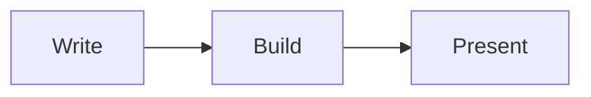

+++
title = "Mermaid diagrams"
classes = ["no_title", "wide"]
+++

# Mermaid diagrams

Fence a diagram as `mermaid` and it is drawn while the deck builds:

````markdown

````

<!-- pause -->


<!-- pause -->

> [!IMPORTANT]
> A diagram that does not parse stops the build and names the slide, the same
> way bad `$…$` math does.

<!-- notes -->

The renderer is `mermaid-rs-renderer` — pure Rust, no Node and no headless
browser — so a diagram costs a couple of milliseconds at build time rather than
a script tag at present time. Same trade the math directive makes: the SVG is
part of the document, so the deck draws its diagrams offline, in the PDF, and in
the slide thumbnails from one source of truth.

Output is close to mermaid.js but not identical; the crate is young and says so.

`<!-- code:mermaid:diagrams/architecture.mmd -->` embeds a diagram from a file.
Fence parameters cannot be combined with that form — the directive splits on the
first colon, so they would be read as part of the path.
