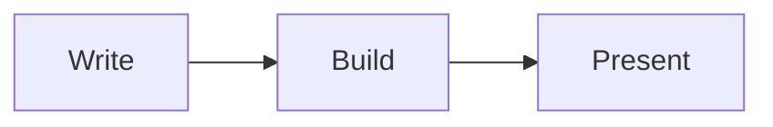

# toboggan-cli

The parser and the exporters: it turns a folder of Markdown into a
[`Talk`](../toboggan-core), and a `Talk` into TOML, JSON, YAML, HTML, Typst, or a
folder of thumbnails.

> [!IMPORTANT]
> This is a **library crate with no binary**. Everything below is reached through
> the unified [`toboggan`](../toboggan) command.

## A deck is a folder

```
my-talk/
├── toboggan.toml           # optional configuration
├── public/                 # images and other assets, served at /public/
└── slides/
    ├── _cover.md           # the cover slide, and the deck's own front matter
    ├── _head.html          # injected into <head> — fonts, custom CSS
    ├── _footer.html        # the footer shown on every slide
    ├── 1_intro/
    │   ├── _part.md        # the section title slide
    │   ├── 1-why.md
    │   └── 2-how.md
    └── 2_demo/
        └── 1-live.md
```

Ordering comes from the filenames, and the leading `N_` / `N-` is stripped from
what is displayed. A folder without a `_part.md` still gets a section slide,
titled from the folder name.

```bash
toboggan build -p ./my-talk/slides -o talk.toml
toboggan build -p ./my-talk/slides -o deck.html --base-url /my-talk/
toboggan build --list-themes                       # syntax themes for code blocks
```

| `-o` extension | Output |
| --- | --- |
| `.toml` | The built deck (the default; what `toboggan serve` reads) |
| `.json`, `.yaml` | The same model, other encodings |
| `.html` | One self-contained, navigable file — no CDN, no external assets |
| `.typ` | Typst source, for `toboggan pdf` |

The HTML export is a real deck, not a printout: arrow keys, space,
`PageUp`/`PageDown`, step reveals, `#slide-N` deep links and `f` for fullscreen,
all from a small inline script. The deck's `public/` folder is copied next to it.

## Front matter

Every slide may open with a TOML block. **Unknown keys are an error**, so a typo
tells you instead of silently doing nothing.

```markdown
+++
title = "Why borrow?"
classes = ["wide", "no_title"]
duration = "2m 30s"
+++
```

| Key | Meaning |
| --- | --- |
| `title` | Overrides the title taken from the first heading |
| `skip` | Leave the slide out of the build entirely |
| `classes` | CSS classes on the slide's `<section>` |
| `style` | Inline `style` attribute for the slide |
| `duration` | Planned speaking time — seconds, or `"2m 30s"` |
| `hidden_in` | Render targets to omit this slide from: `web`, `pdf` |
| `quake_cwd` | Working directory for the quake terminal on this slide |
| `disabled_rules` | Lint rule ids to silence for this slide |
| `date` | Deck-level, read from `_cover.md` |
| `lang` | Deck-level BCP 47 tag, read from `_cover.md` |

## Directives

HTML comments in the body do the things Markdown has no syntax for:

```markdown
Everyone sees this first.

<!-- pause -->

This appears on the next press.

<!-- code:rust:snippets/hello.rs -->

<!-- term: . | cargo test -->

<!-- lint-disable content/excessive-words -->

<!-- notes -->
Everything after this is speaker notes, and never reaches the projector.
```

| Directive | What it does |
| --- | --- |
| `<!-- pause -->` | A step boundary. Takes CSS classes: `<!-- pause fade -->` |
| `<!-- notes -->` | Everything after it is speaker notes |
| `<!-- code:<info>:<path> -->` | Embeds a file as a code block |
| `<!-- term: <cwd> -->` | An embedded terminal, live in the web client |
| `<!-- term: <cwd> :light -->` | …with the light theme |
| `<!-- term: <cwd> \| <command> -->` | …running a command on connect |
| `<!-- lint-disable <ids> -->` | Silences lint rules for this slide |

> [!IMPORTANT]
> Paths in `<!-- code -->` resolve against the **parent** of the folder you pass
> to `-p`. With `-p ./my-talk/slides`, a path of `./snippets/main.rs` is
> `./my-talk/snippets/main.rs` — which is why a deck keeps its snippets beside
> `slides/` rather than inside it.

## Diagrams

A ```` ```mermaid ```` fence is drawn to SVG while the deck builds, so the diagram is
part of the document: the web client, the exported HTML, the PDF and the slide
thumbnails all show the same picture, with no script and no network. A diagram
that does not parse fails the build and names the slide.

````markdown

````

| Parameter | What it does |
| --- | --- |
| `theme` | `default`, `dark`, `forest`, `neutral`, `modern` |
| `background` | `transparent` (the default), `theme`, or a colour |
| `width` | How much of the slide the diagram fills, e.g. `60%` |
| `nodeSpacing`, `rankSpacing` | Loosen or tighten the layout |
| `aspectRatio` | Bias the shape, e.g. `16:9` |
| `maxLabelWidth` | Characters before a label wraps |
| `fastText` | Measure labels without the system font database (on by default) |
| `class`, `alt` | Extra CSS class; accessible label |

An unknown parameter is an error rather than a silent no-op, like everything
else here. Deck-wide defaults come from a JSON file in Mermaid's own config
shape, named by `--mermaid-config` or `[build] mermaid-config`; a fence's own
parameters win over it, and Mermaid's `%%{init: {…}}%%` still works inside the
diagram.

`background` defaults to `transparent` rather than Mermaid's opaque page colour,
because a themed slide rarely wants a white rectangle punched into it.

> [!NOTE]
> Rendering is [`mermaid-rs-renderer`][mmdr] — pure Rust, no Node and no
> headless browser. It covers 23 diagram types and is close to mermaid.js, but
> not pixel-identical: the crate is young and says so.
>
> `fastText` also keeps geometry reproducible across machines. Turning it off,
> or using non-ASCII labels, measures against whatever fonts the *building*
> machine has installed, so the same deck can lay out differently elsewhere.

## Using it as a library

```rust,ignore
use std::path::Path;
use toboggan_cli::{parse_presentation, Settings};

let result = parse_presentation(Path::new("./my-talk/slides"), &settings)?;
let talk = result.talk;
```

Also public: `output` (the renderers), `scaffold` (what `toboggan new` writes),
`stats`, `display`, and `TobogganCliError`, which is a [`miette`] diagnostic — so
a parse failure points at the offending line in the offending file.

## License

MIT or Apache-2.0, at your option.

[mmdr]: https://crates.io/crates/mermaid-rs-renderer
[`miette`]: https://github.com/zkat/miette
