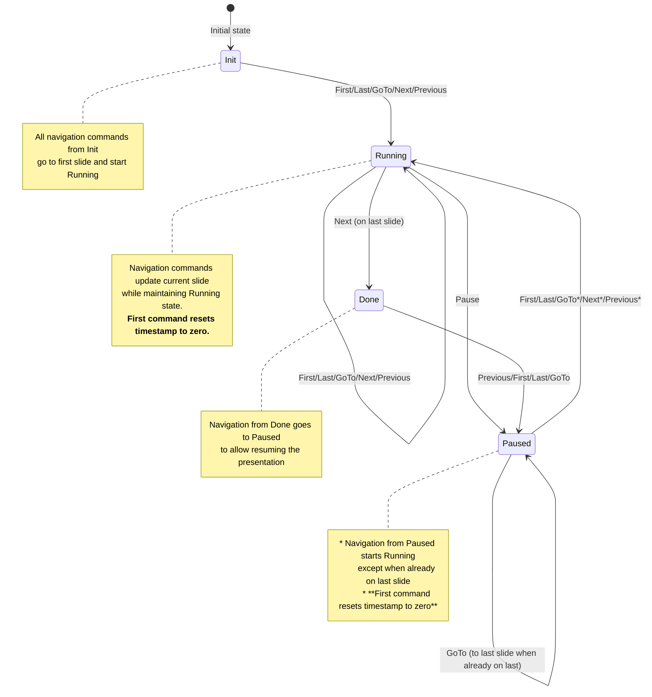

# Toboggan Server

The Toboggan server is an Axum-based web server that serves presentations and provides real-time synchronization across multiple clients via WebSocket.

## State Machine

The presentation system uses a state machine with four states: `Init`, `Paused`, `Running`, and `Done`. Below is a diagram showing how commands transition between states:

## Command Behavior Details

### From `Init` State
- **All navigation commands** (`First`, `Last`, `GoTo`, `Next`, `Previous`) → Navigate to **first slide** and transition to `Running`

### From `Paused` State
- **`First`** → Navigate to first slide and transition to `Running`
- **`Last`** → Navigate to last slide and transition to `Running` (unless already on last slide, then stay `Paused`)
- **`GoTo(slide)`** → Navigate to specified slide and transition to `Running` (unless going to last slide while already on last, then stay `Paused`)
- **`Next`** → Navigate to next slide and transition to `Running` (unless on last slide, then stay `Paused`)
- **`Previous`** → Navigate to previous slide and transition to `Running` (unless on last slide, then stay `Paused`)
- **`Resume`** → Transition to `Running` with current slide

### From `Running` State
- **`First`** → Navigate to first slide (stay `Running`)
- **`Last`** → Navigate to last slide (stay `Running`)
- **`GoTo(slide)`** → Navigate to specified slide (stay `Running`)
- **`Next`** → Navigate to next slide (stay `Running`), or transition to `Done` if on last slide
- **`Previous`** → Navigate to previous slide (stay `Running`)
- **`Pause`** → Transition to `Paused` with current slide

### From `Done` State
- **All navigation commands** → Navigate to requested slide and transition to `Paused`

## Special Commands
- **`Ping`** → Returns `Pong` (no state change)
- **`Register`/`Unregister`** → Handled separately via WebSocket (no state change)

## State Properties

Each state maintains different information:
- **`Init`**: No slide information
- **`Paused`**: Current slide + total duration
- **`Running`**: Current slide + start timestamp + total duration  
- **`Done`**: Current slide + total duration