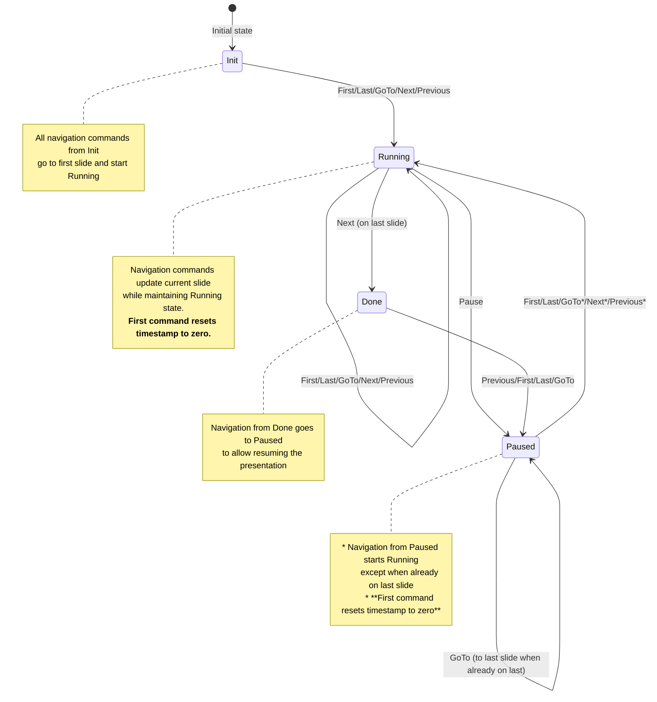

# Toboggan Server

The Toboggan server is a high-performance, Axum-based web server that serves presentations and provides real-time synchronization across multiple clients via WebSocket. Built with async Rust, it handles concurrent connections efficiently while maintaining presentation state consistency.

## Features

- **Real-time Synchronization**: WebSocket-based multi-client communication
- **REST API**: HTTP endpoints for health checks and presentation management
- **Presentation State Machine**: Robust state management with clear transitions
- **Multi-format Support**: Serves TOML presentations with rich content types
- **Concurrent Client Support**: Handles multiple presenters and viewers simultaneously
- **Health Monitoring**: Built-in health checks and monitoring endpoints

## Quick Start

### Running the Server

```bash
# Start server with example presentation
cargo run -p toboggan-server

# Or with custom presentation
cargo run -p toboggan-server -- path/to/presentation.toml

# With custom host and port
cargo run -p toboggan-server -- --host 0.0.0.0 --port 3000 presentation.toml
```

### Client Connections

Once running, clients can connect via:
- **Web Interface**: http://localhost:8080
- **WebSocket**: ws://localhost:8080/api/ws
- **Health Check**: http://localhost:8080/api/health

## REST API

### Endpoints

| Method | Path | Description |
|--------|------|-------------|
| `GET` | `/` | Web interface (static files) |
| `GET` | `/api/health` | Server health check |
| `GET` | `/api/ws` | WebSocket upgrade endpoint |
| `GET` | `/api/presentation` | Current presentation metadata |

### Health Check Response

```json
{
  "status": "ok",
  "timestamp": "2025-01-26T12:00:00Z",
  "clients": 3,
  "presentation": "My Talk"
}
```

## WebSocket Protocol

The server uses a JSON-based WebSocket protocol for real-time communication with clients.

### Client → Server (Commands)

```json
// Navigation Commands
{ "type": "Next" }
{ "type": "Previous" }
{ "type": "First" }
{ "type": "Last" }
{ "type": "Goto", "slide": 5 }

// Presentation Control
{ "type": "Play" }
{ "type": "Pause" }
{ "type": "Resume" }

// Client Management
{ "type": "Register", "client_id": "presenter-abc123" }
{ "type": "Unregister", "client_id": "presenter-abc123" }

// Heartbeat
{ "type": "Ping", "timestamp": 1735210800000 }
```

### Server → Client (Notifications)

```json
// State Updates
{
  "type": "State",
  "timestamp": 1735210800000,
  "state": {
    "type": "Running",
    "current": 3,
    "started": 1735210750000,
    "total_duration": 45000
  }
}

// Error Messages
{
  "type": "Error",
  "message": "Invalid slide index: 10"
}

// Heartbeat Response
{
  "type": "Pong",
  "timestamp": 1735210800000
}
```

### Connection Flow

1. **Client Connects**: WebSocket handshake at `/api/ws`
2. **Registration**: Client sends `Register` command with unique ID
3. **State Sync**: Server sends current presentation state
4. **Command Processing**: Client sends navigation/control commands
5. **State Broadcast**: Server broadcasts state updates to all clients
6. **Heartbeat**: Periodic ping/pong for connection health

### Error Handling

The server provides descriptive error messages for invalid commands:

```json
// Invalid slide index
{ "type": "Error", "message": "Slide index 15 out of range (0-10)" }

// Command not available in current state
{ "type": "Error", "message": "Cannot play: presentation is already running" }

// Malformed command
{ "type": "Error", "message": "Invalid command format: missing 'type' field" }
```

## Presentation State Machine

The presentation system uses a state machine with four states: `Init`, `Paused`, `Running`, and `Done`. Below is a diagram showing how commands transition between states:



## Command Behavior Details

### From `Init` State
- **All navigation commands** (`First`, `Last`, `GoTo`, `Next`, `Previous`) → Navigate to **first slide** and transition to `Running`

### From `Paused` State
- **`First`** → Navigate to first slide and transition to `Running`
- **`Last`** → Navigate to last slide and transition to `Running` (unless already on last slide, then stay `Paused`)
- **`GoTo(slide)`** → Navigate to specified slide and transition to `Running` (unless going to last slide while already on last, then stay `Paused`)
- **`Next`** → Navigate to next slide and transition to `Running` (unless on last slide, then stay `Paused`)
- **`Previous`** → Navigate to previous slide and transition to `Running` (unless on last slide, then stay `Paused`)
- **`Resume`** → Transition to `Running` with current slide

### From `Running` State
- **`First`** → Navigate to first slide (stay `Running`)
- **`Last`** → Navigate to last slide (stay `Running`)
- **`GoTo(slide)`** → Navigate to specified slide (stay `Running`)
- **`Next`** → Navigate to next slide (stay `Running`), or transition to `Done` if on last slide
- **`Previous`** → Navigate to previous slide (stay `Running`)
- **`Pause`** → Transition to `Paused` with current slide

### From `Done` State
- **All navigation commands** → Navigate to requested slide and transition to `Paused`

## Special Commands
- **`Ping`** → Returns `Pong` (no state change)
- **`Register`/`Unregister`** → Handled separately via WebSocket (no state change)

## State Properties

Each state maintains different information:
- **`Init`**: No slide information
- **`Paused`**: Current slide + total duration
- **`Running`**: Current slide + start timestamp + total duration  
- **`Done`**: Current slide + total duration

## Configuration

### Command Line Options

```bash
toboggan-server [OPTIONS] [PRESENTATION]

Arguments:
  [PRESENTATION]  Path to presentation TOML file

Options:
  -h, --host <HOST>      Host to bind to [default: 127.0.0.1]
  -p, --port <PORT>      Port to bind to [default: 8080]
      --help             Print help
      --version          Print version
```

### Environment Variables

```bash
# Server configuration
export TOBOGGAN_HOST=0.0.0.0
export TOBOGGAN_PORT=3000

# Logging
export RUST_LOG=info                    # Basic logging
export RUST_LOG=toboggan_server=debug   # Debug server logs
export RUST_LOG=trace                   # Verbose logging
```

## Development

### Building and Testing

```bash
# Build the server
cargo build -p toboggan-server

# Run tests
cargo test -p toboggan-server

# Run with debug logging
RUST_LOG=debug cargo run -p toboggan-server

# Build optimized release
cargo build -p toboggan-server --release
```

### Testing WebSocket Connections

```bash
# Test WebSocket with websocat
websocat ws://localhost:8080/api/ws

# Send commands interactively
{"type": "Register", "client_id": "test-client"}
{"type": "Next"}
{"type": "Pause"}
```

## Deployment

### Docker Deployment

```dockerfile
FROM rust:1.88 as builder
WORKDIR /app
COPY . .
RUN cargo build --release -p toboggan-server

FROM debian:bookworm-slim
RUN apt-get update && apt-get install -y ca-certificates
COPY --from=builder /app/target/release/toboggan-server /usr/local/bin/
COPY presentation.toml /app/
EXPOSE 8080
CMD ["toboggan-server", "/app/presentation.toml"]
```

### Reverse Proxy (nginx)

```nginx
server {
    listen 80;
    server_name your-domain.com;
    
    location / {
        proxy_pass http://127.0.0.1:8080;
        proxy_set_header Host $host;
        proxy_set_header X-Real-IP $remote_addr;
    }
    
    location /api/ws {
        proxy_pass http://127.0.0.1:8080;
        proxy_http_version 1.1;
        proxy_set_header Upgrade $http_upgrade;
        proxy_set_header Connection "upgrade";
        proxy_set_header Host $host;
    }
}
```

## Monitoring

### Health Checks

```bash
# Basic health check
curl http://localhost:8080/api/health

# Example response
{
  "status": "ok",
  "timestamp": "2025-01-26T12:00:00Z",
  "clients": 3,
  "presentation": "My Conference Talk"
}
```

### Logging

The server uses structured logging:

```bash
# Log levels
RUST_LOG=error    # Errors only
RUST_LOG=warn     # Warnings and errors  
RUST_LOG=info     # Info, warnings, errors
RUST_LOG=debug    # Debug info + above
RUST_LOG=trace    # All logs (very verbose)
```

## Architecture

### Core Components

- **WebSocket Handler**: Manages real-time client connections
- **State Manager**: Thread-safe presentation state with `Arc<RwLock<T>>`
- **Command Processor**: Handles presentation navigation and control
- **Broadcast System**: Distributes state updates to all clients
- **REST API**: HTTP endpoints for health checks and metadata

### Concurrency Model

- **Async-first**: All operations are non-blocking using tokio
- **Shared State**: Presentation state shared safely across connections
- **Client Isolation**: Each WebSocket connection handled independently
- **Atomic Updates**: State changes are atomic and consistent

## Troubleshooting

### Common Issues

**Server Won't Start:**
```bash
# Check if port is already in use
lsof -i :8080

# Try different port
cargo run -p toboggan-server -- --port 3000 presentation.toml
```

**WebSocket Connection Failed:**
```bash
# Check server is running
curl http://localhost:8080/api/health

# Test WebSocket endpoint manually
websocat ws://localhost:8080/api/ws
```

**Presentation Not Loading:**
```bash
# Validate TOML syntax
toml_verify presentation.toml

# Check file permissions and existence
ls -la presentation.toml
```